## 🚀 Project Management System

 
 
 

    <a href="https://github.com/your-username/project-management-system">
        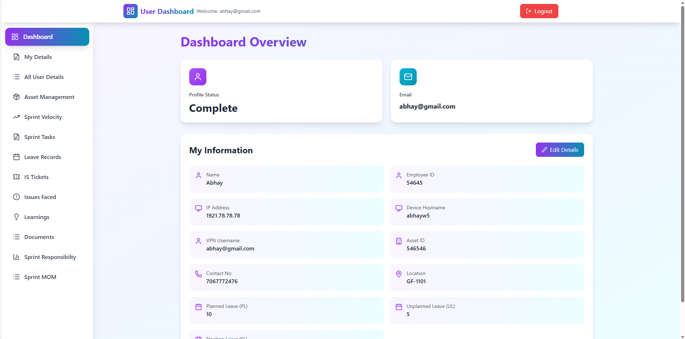
    </a>

---

## 🎯 Purpose of the Project

The purpose of this project is to provide a **centralized system** for managing **user information, assets, sprint activities, and organizational data**.

It helps teams track employee details, assigned assets, sprint progress, leave records, issues, documents, and learnings efficiently through a modern web-based dashboard.

This system is designed to improve **productivity, transparency, and data management** within an organization.

---

## 📌 Introduction

- **Project Management System** is a full-stack web application.
- It allows users to **register and log in securely**.
- Users can manage their **personal and professional details**.
- Admins and users can collaborate through multiple organizational modules.
- Designed with a **modern UI and scalable backend architecture**.

---

## 🔐 Authentication Module (Login & Register)

### 📝 Register (Sign Up)
- New users can create an account using:
  - Name
  - Email
  - Password
  - Confirm Password
- Validations ensure secure account creation.
- Redirects users to login after successful registration.

### 🔑 Login (Sign In)
- Existing users can log in using:
  - Email
  - Password
- Secure authentication handled via backend API.
- After login, users are redirected to the **Dashboard Overview**.

    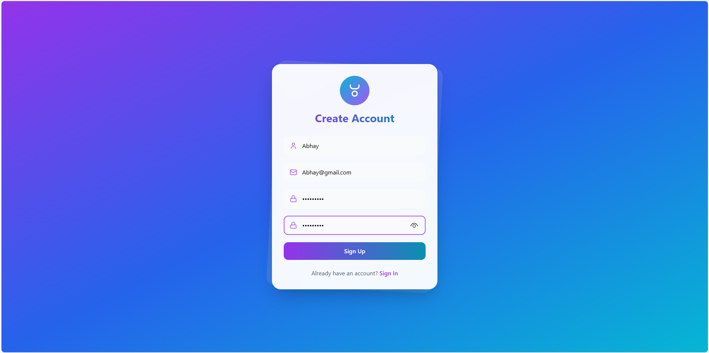
    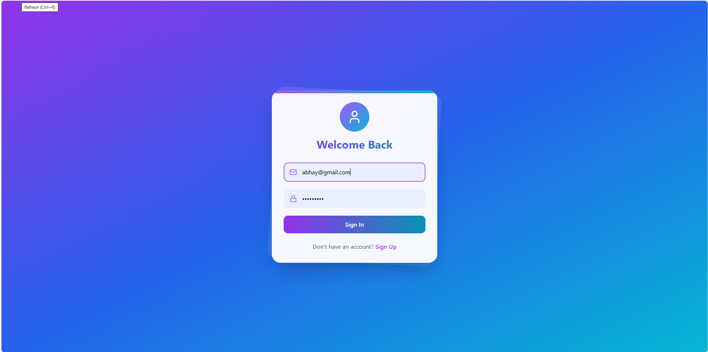

---

## 👤 User Details Module (My Details)

The **User Details** module allows users to manage all their personal and system-related information.

- Users can add and edit:
  - Name
  - Employee ID
  - IP Address
  - Device Hostname
  - VPN Username
  - Contact Number
  - Location
  - Work Mode (WFH / Hybrid / Office)
- Tracks **Leave Balance**:
  - Planned Leave (PL)
  - Unplanned Leave (UL)
  - Floating Leave (FL)
- Profile completion status shown on dashboard.
- Editable using **Add Details / Edit Details** options.

    
    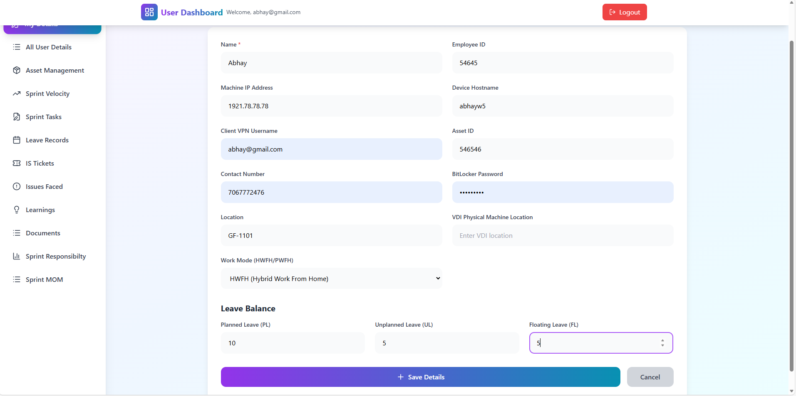
    
    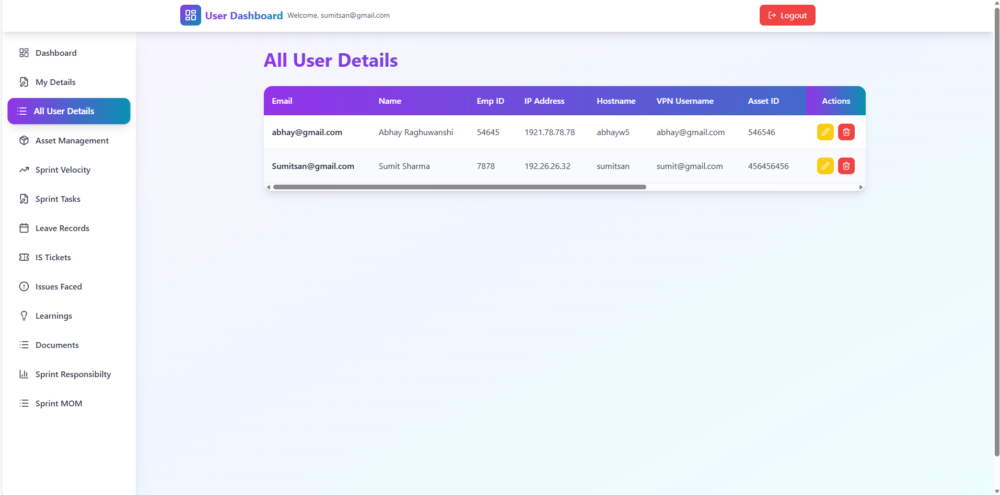

---

## 📄 Application Modules
---

### 🚀 Sprint Velocity Tracker
- Displays current sprint details and duration.
- Shows total, completed, and in-progress story points.
- Visual sprint velocity graph for performance analysis.

    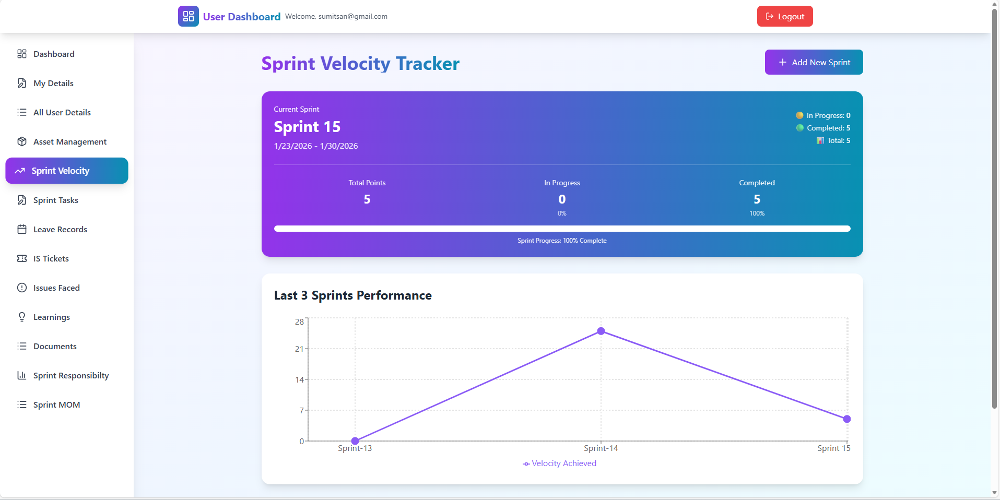

### 📊 Sprint Task Management
- Create and manage sprint-wise tasks.
- Track task status:
  - Total
  - Completed
  - In Progress
  - On Hold
- Manage Epic, Story, Task, and Story Points.
- Assign Owners, Coordinators, and Reviewers.
- Export sprint data to Excel.

    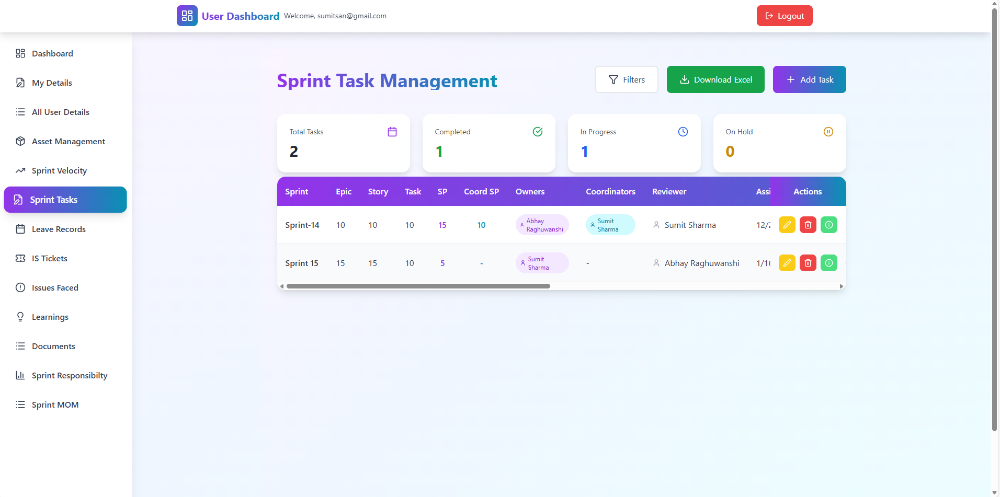
    

---

### 🏖️ Leave Records Management
- Apply leave using date range.
- Automatically calculates business days.
- Supports:
  - Planned Leave (PL)
  - Unplanned Leave (UL)
  - Floating Leave (FL)
- Displays leave history and balance.

    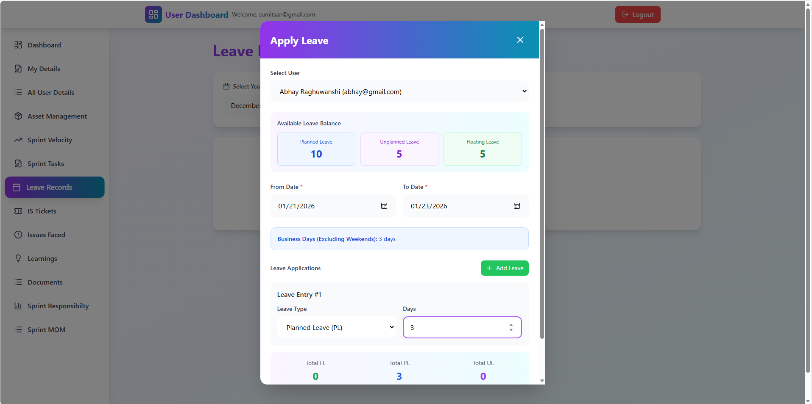
    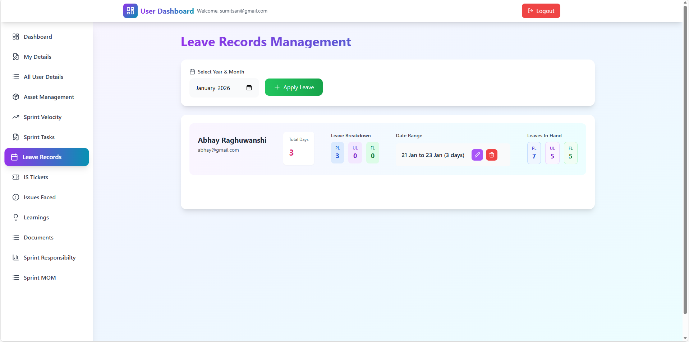

---

### 🎫 IS Ticket Management
- Raise internal IT/support tickets.
- Track tickets by:
  - Purpose
  - Category
  - Raised by
- Search, edit, and delete tickets.

    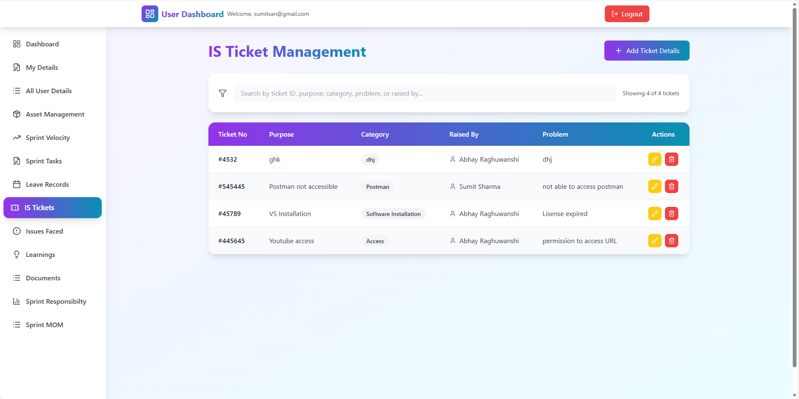

---

### 🐞 Issues Faced Management
- Report technical or project issues.
- Capture:
  - Issue details
  - Investigation notes
  - Resolution approach
- Mark issues that caused delivery delays.

    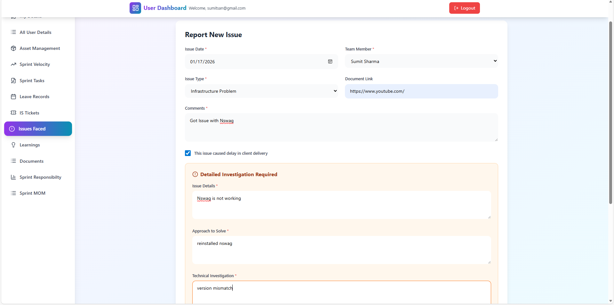
    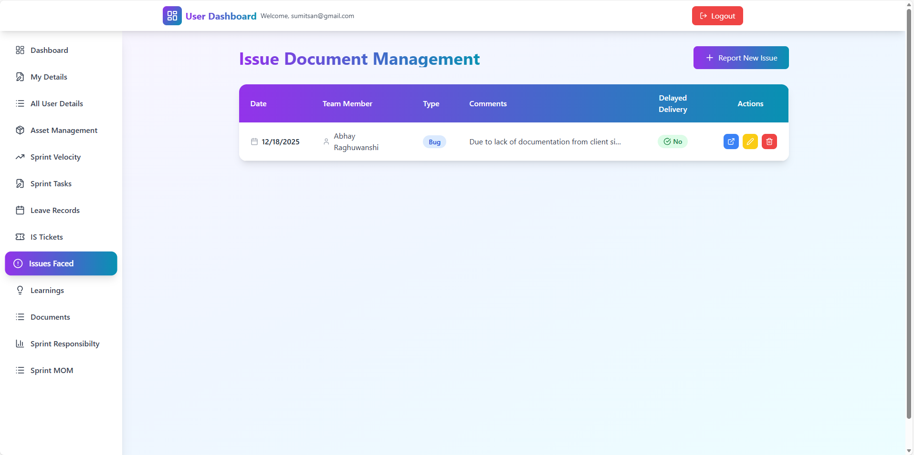

---

### 📚 Learnings Management
- Document learnings from:
  - Training
  - Team discussions
  - Self-learning
- Filter by month and source.
- Search and manage learning records.

    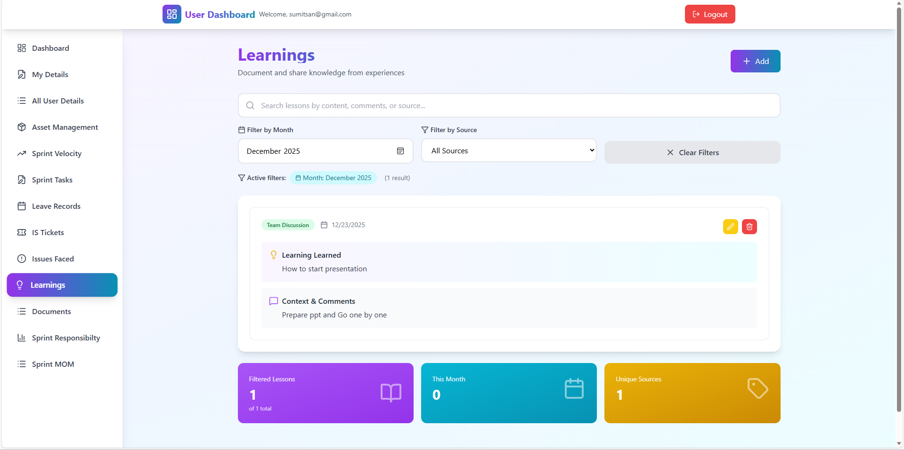
    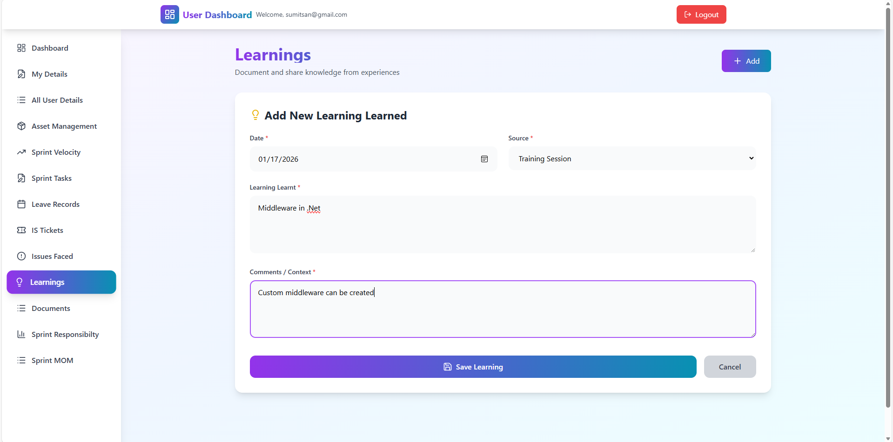

---

### 📄 Document Management
- Upload and manage important documents.
- Organize by document type and uploader.
- Store and access shared document links.

    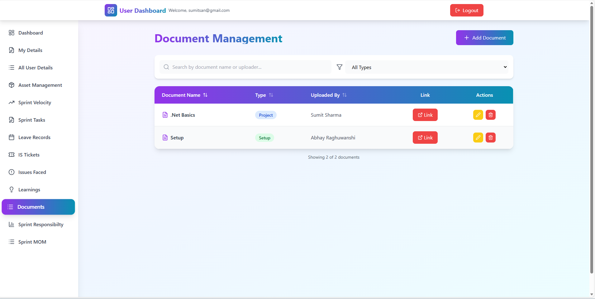
    

---
### 🧑‍💼 Sprint Responsibility

The **Sprint Responsibility** module helps define and track key roles and responsibilities for each sprint, ensuring clarity and accountability within the team.

- View sprint-wise responsibility configuration.
- Displays:
  - Sprint Number
  - Start Date & End Date
  - Sprint Duration
- Assign and manage responsibilities for:
  - **DSR Sending**
  - **Data Matrix Owner**
  - **Scrum Master**
- Supports adding new sprint responsibility configurations.
- Allows editing and deleting existing sprint responsibility records.
- Helps ensure proper ownership and smooth sprint execution.

    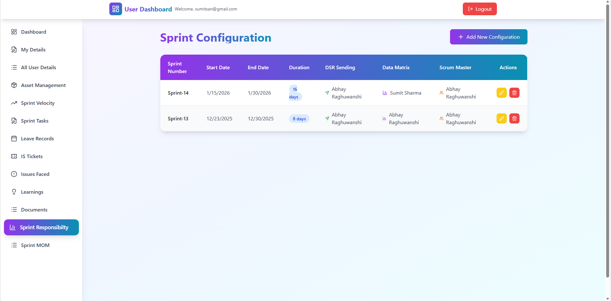

## 🏛️ Tech Used

- [React](https://react.dev/)
- [Tailwind CSS](https://tailwindcss.com/)
- [HTML](https://developer.mozilla.org/en-US/docs/Learn/HTML)
- [CSS](https://developer.mozilla.org/en-US/docs/Web/CSS)
- [JavaScript](https://javascript.info/)
- [.NET Web API](https://learn.microsoft.com/en-us/aspnet/core/web-api/)
- RESTful Services
- SQL Server / DynamoDB

---

## 💻 Author

Created with 💖 by **Abhay Raghuwanshi**

- [GitHub](https://github.com/abhay-72-git))
- [LinkedIn](https://www.linkedin.com/in/abhay-raghuwanshi-619517217/))
- [Email](mailto:abhayraghuwanshi088@gmail.com)
---

## 🤝 Contributing

Pull requests are welcome.  
For major changes, please open an issue first to discuss what you would like to change.

---

